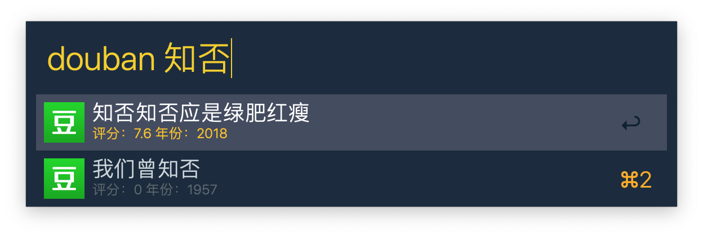

# alfred-douban

Alfred 3 workflow to find movie from douban.

[](https://npmjs.org/package/alfred-douban)
[](https://travis-ci.org/sorrycc/alfred-douban)
[](https://npmjs.org/package/alfred-douban)



## Feature

- ✔︎ Find movie from [douban.com](https://www.douban.com/)

## Installation

```bash
$ yarn global add alfred-douban
```

## Usage

In Alfred, type `douban`, `Enter`, and some text, to find relevant movie.

## LICENSE

MIT © [Chen Cheng](https://sorrycc.com)
